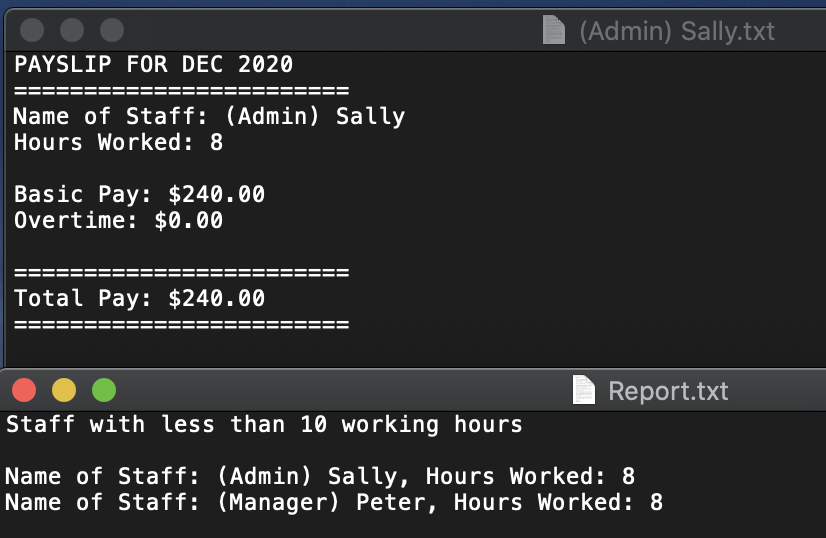

# PayrollProject

## C# Payroll App

 User asked for year (2020), month (12), and the hours worked for 6 employees.  After receiving the info, the app tells the user how much each employee earned.  The app also creates a separate .txt file for of each employee's hours and pay.  The app also creates a report.txt for all employees that worked less than 10 hours that week.
